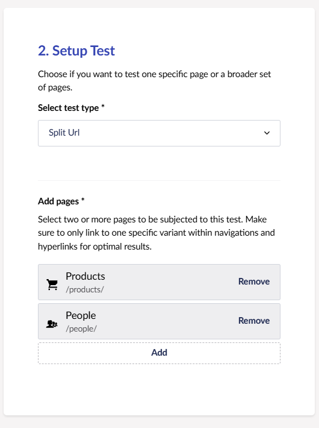

# Split URL Test

Split URL testing in Umbraco Engage allows you to compare different versions of a page to see which one performs better.

To set up a Split URL test, create multiple versions of a page. Each version can have different designs, text, or buttons based on the options setup in Umbraco.

You can start a Split URL test from the Engage [section](../../introduction/the-umbraco-engage-section.md) or within the [Content App](../../introduction/content-apps.md). The type is selected in step 2 of the setup.

When you set up the A/B test, you can send 50% of visitors to page A and 50% to page B. This way, you can see which page helps achieve the goal of the test better.

Split URL tests are particularly useful for optimizing elements like checkout workflows, where small changes can impact conversions.
