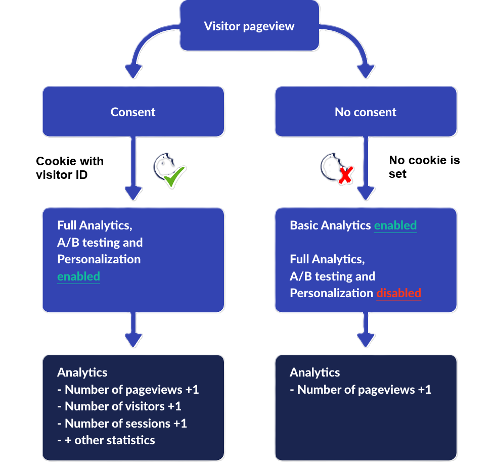

# How it works

When visitors accept the Umbraco Engage cookie on the website, it allows Umbraco Engage to collect and store data about browsing behavior, preferences, and interactions. This data can include pages visited, time spent on each page, actions taken on the site, and more. This data cannot be shared with 3rd parties because the data is stored in the local database of the site.

With this information, Umbraco Engage uses this information to:

* Show Analytics
* Run A/B tests
* Personalize content
* Build local user profiles

When visitors do not accept the Umbraco Engage cookie, the website's ability to collect and store this data is limited. As a result:

* Basic Analytics
* No A/B testing
* No Personalization
* No Profiling

To comply with privacy regulations like GDPR or the California Consumer Privacy Act (CCPA), websites often allow users to accept or reject cookies. This choice impacts the type and depth of data collected and consequently affects the statistical analysis and personalization capabilities of those visitors. Learn more about [cookie permissions](../developers/introduction/the-umbraco-engage-cookie/module-permissions.md).

The diagram below provides a general overview:

