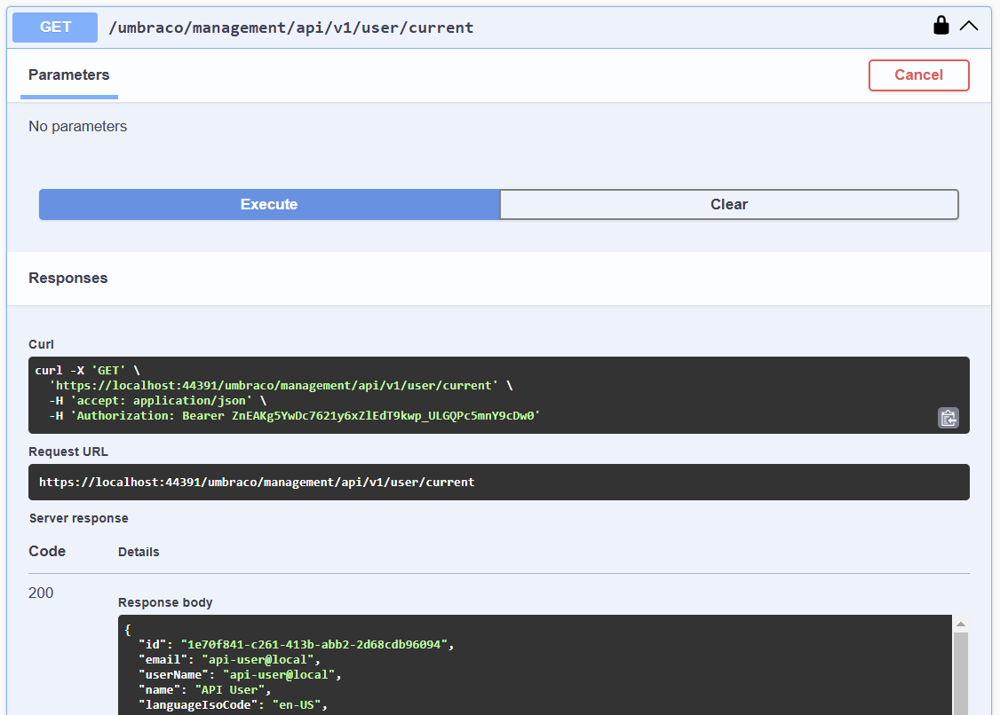

# External access to the Management API

The Management API can be used directly for integrations between Umbraco and external systems.

When consuming the Management API from an external source, we must use the OpenId Connect Client Credentials flow for authorization. For details on setting up Client Credentials, please refer fo the [API Users](../../fundamentals/data/users/api-users.md) article.

With a set of Client Credentials in place, we can obtain an access token from the Management API token endpoint: `/umbraco/management/api/v1/security/back-office/token`. The token endpoint response looks like this:

```json
{
  "access_token": "ZnEAKg5YwDc7621y6xZlEdT9kwp_ULGQPc5mnY9cDw0",
  "token_type": "Bearer",
  "expires_in": 299
}
```

As shown, the access token should be used as a Bearer token when consuming the Management API.

Also notice that access tokens have a fixed expiry. While we can keep issuing new tokens for our Client Credentials, please reuse tokens within their lifespan. This will be more performant, and will also keep from flooding the Umbraco database with tokens.


Please notice that the Management API does not support OIDC Discovery. This is reserved for accessing protected for Members via the [Delivery API](../content-delivery-api/protected-content-in-the-delivery-api.md).


The following code sample demonstrates how to consume the Management API by:

1. Obtaining an access token from the token endpoint.
2. Fetching data from the "current user" endpoint.




This sample requires the [`IdentityModel`](https://www.nuget.org/packages/IdentityModel) NuGet package to run.



```csharp
using System.Net.Http.Json;
using IdentityModel.Client;

// the base URL of the Umbraco site - change this to fit your own setup
const string host = "https://localhost:44391";

var client = new HttpClient();

// request a client credentials token from the Management API token endpoint
var tokenResponse = await client.RequestClientCredentialsTokenAsync(
    new ClientCredentialsTokenRequest
    {
        Address = $"{host}/umbraco/management/api/v1/security/back-office/token",
        ClientId = "umbraco-back-office-my-client",
        ClientSecret = "my-client-secret"
    }
);

if (tokenResponse.IsError || tokenResponse.AccessToken is null)
{
    Console.WriteLine($"Error obtaining a token: {tokenResponse.ErrorDescription}");
    return;
}

// use the access token as Bearer token
client.SetBearerToken(tokenResponse.AccessToken);

// fetch user data from the "current user" Management API endpoint
var apiResponse = await client.GetAsync($"{host}/umbraco/management/api/v1/user/current");
var apiUserResponse = await apiResponse
    .EnsureSuccessStatusCode()
    .Content
    .ReadFromJsonAsync<ApiUserResponse>();

if (apiUserResponse is null)
{
    Console.WriteLine("Could not parse a user from the API response.");
    return;
}

Console.WriteLine($"Hello, {apiUserResponse.Name} ({apiUserResponse.Email})");

public class ApiUserResponse
{
    public required Guid Id { get; set; }

    public required string Name { get; set; }

    public required string Email { get; set; }
}
```

